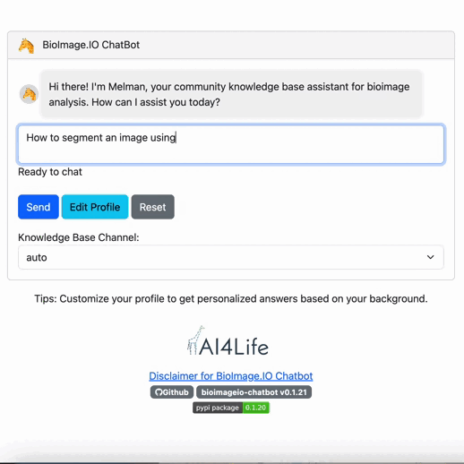

# 🦒 BioImage.IO Chatbot 🤖

**📣New Preprint: <a href="https://zenodo.org/records/10032228" target="_blank"></a>**

**👇 Want to Try the Chatbot? [Sign Up Here!](https://forms.gle/fEnj68Rxut1VUX1Y8)**

🔍 We are currently looking for early testers. If you are interested, please sign up using [this form](https://forms.gle/fEnj68Rxut1VUX1Y8). We will get back to you soon!

## Your Personal Assistant in BioImage Analysis

Welcome to the BioImage.IO Chatbot user guide. This guide will help you get the most out of the chatbot, providing detailed information on how to interact with it and retrieve valuable insights related to bioimage analysis.

## Introduction

The BioImage.IO Chatbot is a versatile conversational agent designed to assist users in accessing information related to bioimage analysis. It leverages the power of Large Language Models (LLMs) and integrates user-specific data to provide contextually accurate and personalized responses. Whether you're a researcher, developer, or scientist, the chatbot is here to make your bioimage analysis journey smoother and more informative.





Here you can find usage guide and more examples: [Usage guide and example screenshots](docs/usage-example.md).

## Chatbot Features

The BioImage.IO Chatbot offers the following features:

* **Contextual Understanding**: The chatbot can understand the context of your questions, ensuring responses are relevant and informative.

* **Personalization**: By incorporating your background information, the chatbot tailors responses to meet your specific requirements.

* **Document Retrieval**: It can search through extensive documentation to provide detailed information on models, applications, datasets, and more. For example, the Chatbot is able to retrieve information from the [bio.tools](https://bio.tools), [ImageJ.net](https://imagej.net/), [deepImageJ](https://deepimagej.github.io), [ImJoy](https://imjoy.io/#/) and [bioimage.io](https://bioimage.io). The full list of supported databases can be found in the [`knowledge-base-manifest.yaml`](knowledge-base-manifest.yaml) file.

* **Query Structured Database by Script Execution**: The chatbot can generate Python scripts for complex queries in structured databases (e.g., csv, json file, SQL databases), helping you perform advanced tasks such as specific questions about the available models at [bioimage.io](https://bioimage.io).


## Using the Chatbot

We are providing a public chatbot service for you to try out. Please sign up [here](https://forms.gle/fEnj68Rxut1VUX1Y8) to get access to the chatbot. After approval, you will receive an email from us with detailed instructions on how to access the chatbot.

Please note that the chatbot is still in beta and is being actively developed. See the [Disclaimer for BioImage.IO Chatbot](./docs/DISCLAIMER.md).

If you encounter any issues, please report them via [Github](https://github.com/bioimage-io/bioimageio-chatbot/issues).


### Asking Questions

To ask the chatbot a question, type your query and send it. The chatbot will analyze your question and provide a relevant response. You can ask questions related to bioimage analysis, software tools, models, and more.

### Personalized Responses

The chatbot uses your user profile information, such as your name, occupation, and background, to personalize its responses. This ensures that the information you receive is tailored to your specific needs.


## Setup the Chatbot locally

If you want to run the chatbot server locally, you need to have an OpenAI API key. You can get one by signing up at [OpenAI](https://beta.openai.com/). Once you have your API key, you can install the chatbot package via pip and set the environment variables:

```bash
pip install bioimageio-chatbot
```

```bash
export OPENAI_API_KEY=sk-xxxxxxxx # Required
export BIOIMAGEIO_KNOWLEDGE_BASE_PATH=/path/to/bioimageio-knowledge-base  # Optional, default to ./bioimageio-knowledge-base 
export BIOIMAGEIO_CHAT_LOGS_PATH=./chat-logs # Optional, default to ./chat-logs
```

## Command-line Interface

BioImage.IO Chatbot comes with a command-line interface to facilitate server management, connection to external servers, and knowledge base creation.

You can access the command-line interface by running `python -m bioimageio_chatbot` or the `bioimageio-chatbot` command.

Below are the available commands and options:

### Initialize Knowledge Base

To initialize the knowledge base, use the `init` command:

```bash
python -m bioimageio_chatbot init
```

This will load the knowledge base from the location specified by the `BIOIMAGEIO_KNOWLEDGE_BASE_PATH` environment variable, or use the default path `./bioimageio-knowledge-base`. If the knowledge base is not found, it will be downloaded from the predefined URL (by default, it uses https://uk1s3.embassy.ebi.ac.uk/public-datasets/bioimageio-knowledge-base. It can be overridden with `BIOIMAGEIO_KNOWLEDGE_BASE_URL`).

NOTE: It may take some time to download the knowledge base depending on your internet connection. 
**Example:**

```bash
export BIOIMAGEIO_KNOWLEDGE_BASE_PATH="./my_knowledge_base"
python -m bioimageio_chatbot init
```

After running the `init` command, it will list the databases loaded into the knowledge base.

#### Start Server

To start your own server entirely, use the `start-server` command:

```bash
python -m bioimageio_chatbot start-server [--host HOST] [--port PORT] [--public-base-url PUBLIC_BASE_URL]
```

**Options:**

- `--host`: The host address to run the server on (default: `0.0.0.0`)
- `--port`: The port number to run the server on (default: `9000`)
- `--public-base-url`: The public base URL of the server (default: `http://127.0.0.1:9000`)
- `--login-required`: Whether to require users to log in before accessing the chatbot (default to not require login)

**Example:**

```bash
export OPENAI_API_KEY=sk-xxxxxxxx
export BIOIMAGEIO_KNOWLEDGE_BASE_PATH=./bioimageio-knowledge-base
export BIOIMAGEIO_CHAT_LOGS_PATH=./chat-logs
python -m bioimageio_chatbot start-server --host=0.0.0.0 --port=9000
```
This will create a local server, and the BioImage.IO Chatbot is available at: http://127.0.0.1:9000/public/apps/bioimageio-chatbot-client/index or http://127.0.0.1:9000/assistants

Open the link in a browser, and you will see the chat interface.

Please note that the chatbot server may not be accessible to users outside your local network.

A user guide and technical overview can be found [here](./docs/technical-overview.md).

To be able to share your chatbot service over the internet (especially for users outside your local network), you will need to expose your server publicly. Please, see [Connect to Server](#connect-to-server)


#### Connect to Server

To help you share your chatbot with users external to your local network, you can use our public [BioEngine](https://aicell.io/project/bioengine/) server as a proxy.

To connect to an external BioEngine server, use the `connect-server` command:

```bash
python -m bioimageio_chatbot connect-server [--server-url SERVER_URL]
```

**Options:**

- `--server-url`: The URL of the external BioEngine server to connect to (default: `https://ai.imjoy.io`)
- `--login-required`: Whether to require users to log in before accessing the chatbot (default to not require login)

**Example:**

```bash
export OPENAI_API_KEY=sk-xxxxxxxx
export BIOIMAGEIO_KNOWLEDGE_BASE_PATH=./bioimageio-knowledge-base
export BIOIMAGEIO_CHAT_LOGS_PATH=./chat-logs
python -m bioimageio_chatbot connect-server --server-url=https://ai.imjoy.io
```

First, you will be asked to log in with a hypha account. Either your GitHub or Google account can be reused. Then, the following message containing a link to the chatbot will be displayed: 'The BioImage.IO Chatbot is available at: https://ai.imjoy.io/github|xxxxxx/apps/bioimageio-chatbot-client/index'

Leave your chatbot running to enable users inside or outside your network to access it from this URL.

#### User Management

If you set `--login-required` when running `start-server` or `connect-server`, users will be required to log in before accessing the chatbot. The chatbot will then collect the user's GitHub or Google account information and store it its logs for future analysis.

You can also provide an optional environment variable `BIOIMAGEIO_AUTHORIZED_USERS_PATH` for the chatbot to load a list of authorized users. The file should be a JSON file containing a list of GitHub or Google account names. For example:

```json
{
    "users": [
        {"email": "user1@email.org"}
    ]
}
```

#### Create Knowledge Base

To create a new knowledge base, use the `create-knowledge-base` command:

```bash
python -m bioimageio_chatbot create-knowledge-base [--output-dir OUTPUT_DIR]
```

**Options:**

- `--output-dir`: The directory where the knowledge base will be created (default: `./bioimageio-knowledge-base`)

**Example:**

```bash
export OPENAI_API_KEY=sk-xxxxxxxx
export BIOIMAGEIO_KNOWLEDGE_BASE_PATH=./bioimageio-knowledge-base
python -m bioimageio_chatbot create-knowledge-base --output-dir=./bioimageio-knowledge-base
```


### Running the BioImage.IO Chatbot in a Docker Container

#### Step 1: Build the Docker Image

To run the BioImage.IO Chatbot using a Docker container, follow these steps. First, build the Docker image by running the following command in your terminal:

```bash
docker build -t bioimageio-chatbot:latest .
```

If you prefer to use a pre-built Docker image from Docker Hub, you can pull the image using the following command:

```bash
docker pull alalulu/bioimageio-chatbot:latest
```


#### Step 2: Start the Chatbot Server

After building the Docker image, you can start the chatbot server with the following command:

```bash
docker run -e OPENAI_API_KEY=sk-xxxxxxxxxxxxx -e BIOIMAGEIO_KNOWLEDGE_BASE_PATH=/knowledge-base -p 3000:9000 -v /path/to/local/knowledge-base:/knowledge-base bioimageio-chatbot:latest python -m bioimageio_chatbot start-server --host=0.0.0.0 --port=9000 --public-base-url=http://localhost:3000
```

Replace the placeholders in the command with the following values:

- `sk-xxxxxxxxxxxxx`: Your OpenAI API key.
- `/path/to/local/knowledge-base`: The local path to your knowledge base folder.

Optionally, for improved reproducibility, you can change `latest` to a version tag such as `v0.1.18`.

#### Step 3: Access the Chatbot

The BioImage.IO Chatbot is now running in the Docker container. You can access it locally in your web browser by visiting:

```
http://localhost:3000/public/apps/bioimageio-chatbot-client/index
```

Make sure to replace `3000` with the host port you specified in the `docker run` command.


Enjoy using the BioImage.IO Chatbot!


## Technical Overview

Please read the [technical overview](./docs/technical-overview.md) for more details about the chatbot's design and implementation.

## Join Us as a Community Partner

The BioImage.IO Chatbot is a community-driven project. We welcome contributions from the community to help improve the chatbot's knowledge base and make it more informative and useful to the community.

For more information, please visit the [contribution guidelines](docs/CONTRIBUTING.md).

If you are a tool developer or a database maintainer related to bioimage analysis, you can join us as a community partner. Please get in touch with us via [Github issues](https://github.com/bioimage-io/bioimageio-chatbot/issues).

## Contact Us

If you have any questions, need assistance, or want to contribute to the chatbot's knowledge base, please do not hesitate to contact us via [Github issues](https://github.com/bioimage-io/bioimageio-chatbot/issues). Our team is here to help you get started and make valuable contributions.

Thanks for your support and helping make the BioImage.IO Chatbot more informative and useful to the community.

## Cite Us

If you use the BioImage.IO Chatbot in your research, please cite us:

```
Lei, W., Fuster-Barceló, C., Muñoz-Barrutia, A., & Ouyang, W. (2023). 🦒BioImage.IO Chatbot: A Personalized Assistant for BioImage Analysis Augmented by Community Knowledge Base (0.1.0). Zenodo. https://doi.org/10.5281/zenodo.10032228
```

## Acknowledgements

We thank [AI4Life consortium](https://ai4life.eurobioimaging.eu/) for its crucial support in the development of the BioImage.IO Chatbot.


AI4Life has received funding from the European Union’s Horizon Europe research and innovation programme under grant agreement number 101057970. Views and opinions expressed are, however those of the author(s) only and do not necessarily reflect those of the European Union or the European Research Council Executive Agency. Neither the European Union nor the granting authority can be held responsible for them.
