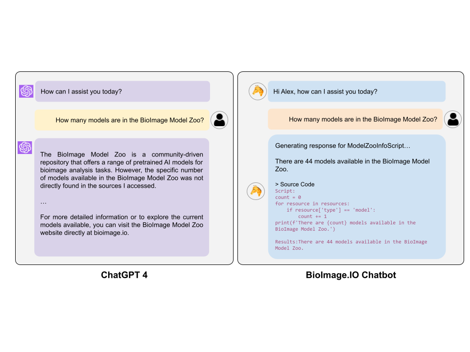
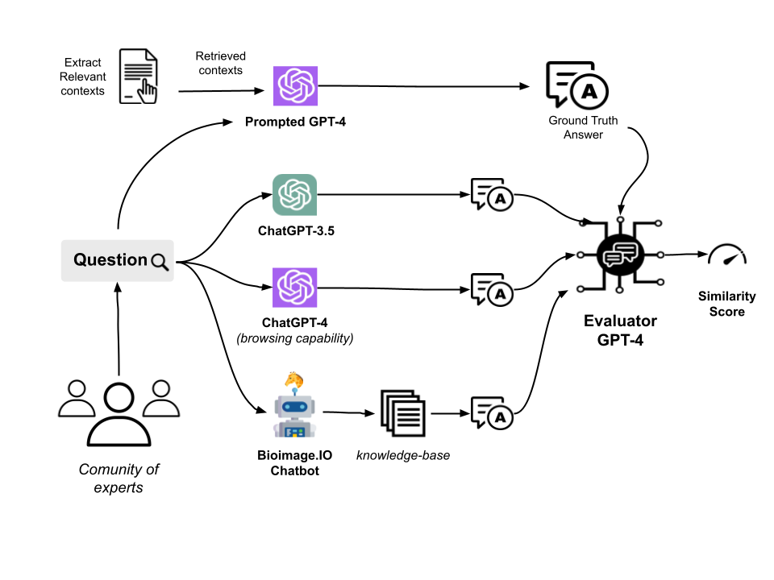
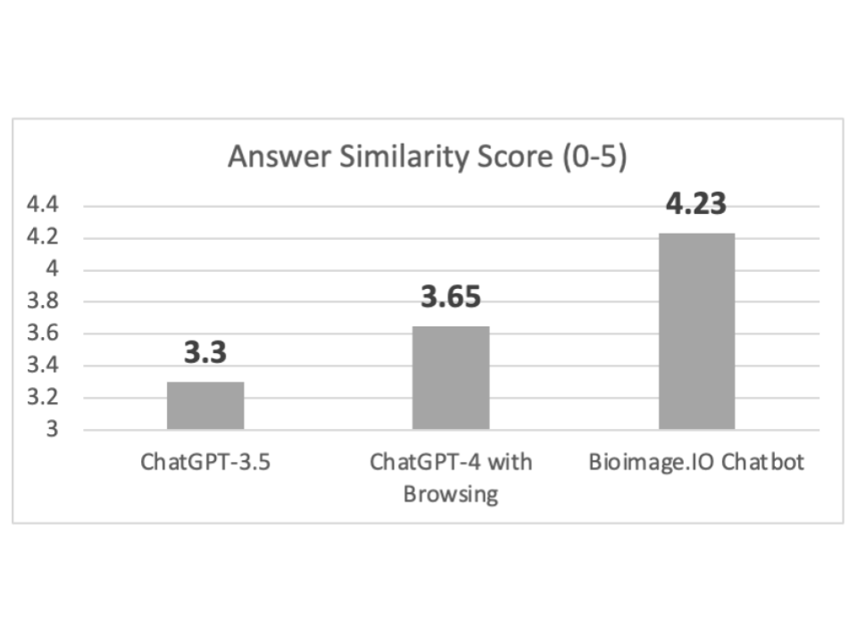

# Decoding Conversational Assistants: BioImage.IO Chatbot and ChatGPT

## Content
- [Introduction](#introduction)
- [Feature Comparison](#feature-comparison)
  * [Context Awareness](#context-awareness)
  * [Personalization](#personalization)
  * [Code generation](#code-generation)
  * [User Experience](#user-experience)
- [Knowledge Retrieval Evaluation](#knowledge-retrieval-evaluation)
- [Example queries](#example-queries)
  * [Q1: Who are the main contributors to ilastik?](#q1--who-are-the-main-contributors-to-ilastik-)
  * [Q2: How many models are in the bioimage model zoo?](#q2--how-many-models-are-in-the-bioimage-model-zoo-)
  * [Q3: What are the image data types in scikit-image?](#q3--what-are-the-image-data-types-in-scikit-image-)

## Introduction 
The document aims to compare and contrast the BioImage.IO Chatbot with ChatGPT, addressing their differences and similarities. The community has expressed curiosity regarding how these two conversational assistants differ, particularly given their distinct purposes. ChatGPT is a generalist tool designed to assist and provide information based on user inputs, regardless of their scope. In contrast, the BioImage.IO Chatbot specializes in bioimage analysis, particularly in relation to the BioImage Model Zoo and other software within its knowledge domain.
One of the main key points of the BioImage.IO Chatbot is the ability to retrieve documentation directly from the knowledge-base channels. 
This feature is intended to facilitate the user's access to relevant information directly from the documentation avoiding "hallucinations" typically seen in GPT-3.5, the free version of ChatGPT. Hence, the BioImage.IO Chatbot is to serve as an assistant to the user regarding those tools and softwares where the documentation is served as knowledge.

## Feature Comparison
The subsequent sections will analyze and compare specific features of both chatbots, highlighting their differences and similarities in each area. 

### Context Awareness
ChatGPT 3.5 (free version) does not possess full context awareness. Each query or input is processed as an isolated instance, even within the same conversation. As a result, it lacks a continuous understanding of the broader dialogue or the capacity to recall past interactions. Meanwhile, ChatGPT 4 it does reatin the previous conversation in the current state through a memory mechanism.
Conversely, the BioImage.IO Chatbot exhibits context awareness, remembering past interactions and leveraging this information to enhance user responses. The context of the conversation serves as input to tailor each prompt to the user's specific needs.

### Personalization
ChatGPT 3.5 is unable to tailor responses to individual user preferences. In contrast, ChatGPT 4.0 offers a degree of personalization by prompting users with questions like "What would you like ChatGPT to know about you to provide better responses?" and "How would you like ChatGPT to respond?" However, this system has its limitations, as it requires users to maintain a single profile for all interactions, necessitating manual updates for different tasks or contexts, such as switching between academic writing and composing a personal note. And it is not available in the free version.

In contrast, the BioImage.IO Chatbot features a more user-friendly approach to customization. It allows users to easily modify their profile to suit different sessions or needs, thanks to a readily accessible "Edit Profile" button. Here, users can enter details like their name, occupation, and background. This flexibility ensures that the chatbot’s responses are always aligned with the current context or task at hand. Additionally, the profile settings can be quickly reset as needed, making the BioImage.IO Chatbot highly adaptable to various situations and user requirements.

### Code generation
While code generation is not a primary feature of the BioImage.IO ChatBot, it inherently possesses this capability due to its foundation on the GPT-4 model. Consequently, our chatbot mirrors the code generation abilities of ChatGPT 4, offering similar functionalities in this regard. The inclusion of code generation in the BioImage.IO ChatBot is an incidental yet useful feature, stemming from its use of GPT-4 as the underlying technology.

## Code execution
### Scripting
The BioImage.IO Chatbot has the functionality to execute scripts for retrieving specific data from the YAML files hosted on the BioImage.IO website. For instance, if a user inquires about models tagged with certain attributes, these details, being stored within the YAML files, can be accessed by the Chatbot. It achieves this by composing a Python script and executing it to perform the search, efficiently extracting the requested information. This feature is not available in ChatGPT 3.5 or 4. 

Here is an example of the same query asked to the BioImage.IO Chatbot and ChatGPT 4.0 in which a simple script is executed to retrieve the number of models in the BioImage Model Zoo:

### API Calls
todo

## Knowledge Retrieval Evaluation
We implemented an evaluation framework to compare the BioImage.IO Chatbot's knowledge retrieval with ChatGPT 3.5 and 4. This approach uses GPT-4 as an evaluator to assess the performance of unstructured text from different LLM-based systems.

### Evaluator Construction
Using a schema-based agent framework, we developed an evaluator with GPT-4. The input schema includes: 
- `question`: the users query,
- `ground truth answer`: the GPT-4 generated benchmark response,
- `llm answer`: the response from the LLM system, 
- `retrieved contexts`: contexts from the knowledge base used for the response (optional).

The output schema provides two scores:
- `similarity score` (0-5 scale): measures alignment between the ground truth and LLM answers.
- `retrieval scores` (0-1 scale) across four metrics: 
  * Retrieval precision: relevance of retrieved contexts.
  * Augmentation precision: integration of context in the response.
  * Augmentation accuracy: context completeness in the response.
  * Answer consistency: accuracy of context-derived information.

### Dataset and evaluation methodology
We curated a benchmark dataset from bioimage analysis experts’ inputs, selecting pertinent questions for evaluation. Ground truth answers were generated using OpenAI's GPT-4 Turbo model, pairing each question with relevant documentation.

The evaluation involved querying ChatGPT 3.5, ChatGPT 4, and the BioImage.IO Chatbot with the same questions. Notably, ChatGPT 4 can browse the web, while our chatbot uses a preset knowledge base. We compared each LLM’s responses to the ground truth for similarity scoring.

### Evaluation 
Through an extense evaluation of more than 50 queries we found that the BioImage.IO Chatbot outperforms ChatGPT 3.5 and 4 in terms of similarity score. As depicted in the figure below, the BioImage.IO Chatbot outperformed ChatGPT 3.5 and 4 in terms of similarity score. The BioImage.IO Chatbot achieved a similarity score of 4.23, while ChatGPT 3.5 and 4 scored 3.3 and 3.65, respectively.

## Example queries
### Q1: Who are the main contributors to ilastik?
#### Answers
* **ChatGPT 3.5, *Similarity score: 2.5:*** The main contributors to ilastik are a group of researchers and developers from the ilastik team at the Biomedical Imaging Group at the Center for Systems Biology at the Max Planck Institute of Molecular Cell Biology and Genetics in Dresden, Germany. The team includes experts in computer vision, machine learning, and image processing, who work together to develop and maintain the ilastik software. 
* **ChatGPT 4.0, *Similarity score: 4.5:*** The main contributors to Ilastik, a popular software for interactive image analysis, are primarily from the scientific research community. Key contributors include: Anna Kreshuk - She has been instrumental in the development of Ilastik and is known for her work in machine learning and image analysis. Fred A. Hamprecht - A professor at Heidelberg University, Hamprecht's lab has played a significant role in the development of Ilastik, focusing on computer vision and machine learning. Carsten Haubold - Involved in the development, focusing on the integration of machine learning methods.Teams from European Molecular Biology Laboratory (EMBL) and Heidelberg University: Collaborative efforts between these institutions have been central to Ilastik's development. These contributors, along with many others in the scientific community, have made significant developments to the software, contributing to its capabilities in image segmentation, classification, and analysis.
* **BioImage.IO Chatbot, *Similarity score: 1:*** The main contributors to ilastik are not explicitly listed in the provided documentation excerpts. However, ilastik is presented as an open-source tool under the BSD license, which invites collaboration and contributions from developers in the field of biomedical image processing. For more detailed information about the contributors, you may want to check the [ilastik homepage](https://www.ilastik.org/documentation/) or contact the community via the [mailing list](mailto:ilastik-user@ilastik.org).

#### Evaluation
This section demonstrates how the three conversational assistants respond to a complex question. In this instance, ChatGPT 3.5 not only failed to answer the question correctly but also fabricated a response. ChatGPT 4.0 managed to answer the question accurately but was unable to provide a link to the relevant documentation. On the other hand, the BioImage.IO Chatbot, while unable to answer the question directly, was aware of its limitations. As a result, despite not having the exact answer, it successfully provided a link to the documentation. 

### Q2: What are the image data types in scikit-image?
#### Answers
* **ChatGPT 3.5, *Similarity score: 3.5:*** In scikit-image, there are several image data types that are commonly used. Some of the most common data types include:
    1. uint8: Unsigned 8-bit integer, which represents grayscale images with pixel values ranging from 0 to 255.
    2. uint16: Unsigned 16-bit integer, suitable for representing images with a wider range of pixel values.
    3. float: Floating point data type, often used for representing images with continuous intensity values.
    These data types are important to consider when working with images in scikit-image, as they can affect the range of values that can be represented and the precision of calculations.
* **ChatGPT 4, *Similarity score: 4.5:*** In scikit-image, image data is primarily represented using NumPy arrays. The common data types for these arrays are: Unsigned Integers:uint8: 8-bit pixel values (0-255)uint16: 16-bituint32: 32-bitSigned Integers:int8, int16, int32, etc.Floating Points:float32, float64: Common for operations that require precision, like normalization. Images are often rescaled to float64 in [0, 1] for processing.Boolean:bool: For binary images (mask, segmentation results).It's important to choose the correct data type based on the range of values your image data contains and the type of processing you intend to perform.
* **BioImage.IO Chatbot, *Similarity score: 5:** In scikit-image, images are represented as NumPy arrays, which support a variety of data types, also known as 'dtypes'. The following dtype ranges are assumed for images to avoid distorting image intensities:
    - `uint8`: 0 to 255
    - `uint16`: 0 to 65535
    - `uint32`: 0 to 2^32 - 1
    - `float`: -1 to 1 or 0 to 1
    - `int8`: -128 to 127
    - `int16`: -32768 to 32767
    - `int32`: -2^31 to 2^31 - 1
    It is important to note that float images should be restricted to the range -1 to 1, even though the data type itself can exceed this range. All integer dtypes, on the other hand, can span the entire data type range. With a few exceptions, 64-bit (u)int images are not supported.
    For more detailed information, you can refer to the [scikit-image Documentation, Release 0.21.0, page 21](https://scikit-image.org/docs/stable/).

#### Evaluation
This example demonstrates how the BioImage.IO Chatbot outperforms ChatGPT 3.5 and 4 in terms of similarity score. This is due to that as it can be seen, the similarity differs between answers. In the first case, ChatGPT 3.5 is only able to show 3 out of 5 data types. Then, the differences between the answers of ChatGPT 4 and the BioImage.IO Chatbot lies in their level of detail and specifity, which is reflected on their similarity scores. The BioImage.IO Chatbot is able to provide more detailed information, including specirfic value ranges for each data type. It is also able to highlight the special consideration for float images, and the limitations of 64-bit images. In addition, the BioImage.IO Chatbot provides a link to the relevant documentation, which is not available in ChatGPT 4.

### Q3: How can I register images using optical flow from scikit-image?
#### Answers
* **ChatGPT 3.5, *Similarity score: 2.5:*** To register images using optical flow with scikit-image, you can use the `register_translation` function. This function estimates the relative offset between two images using phase cross-correlation in the Fourier domain. Here's a basic example of how you can use it: [...] In this example, `image1` and `image2` are the two images you want to register. The `phase_cross_correlation` function returns the estimated subpixel offset between the two images. You can then use this offset to align the images. Remember that this is a basic example, and you may need to adapt it to your specific use case.
* **ChatGPT 4, *Similarity score: 1.5:*** * **ChatGPT 4, Similarity score: 1.5:** As of my last update, scikit-image doesn't directly provide functions for optical flow-based image registration. However, you can use OpenCV, another popular Python library for image processing, which has robust support for optical flow algorithms. Here's a basic approach: 
  - **Install OpenCV**: If you haven't already, install OpenCV using pip: [...]
  - **Read Your Images**: Load the images you want to register.
  - **Preprocess Images**: Convert the images to grayscale if they are in color.
  - **Apply Optical Flow Method**: Use an optical flow method like `cv2.calcOpticalFlowFarneback` in OpenCV to calculate the flow vectors.
  - **Transform the Image**: Use the flow vectors to align the moving image with the reference image.
  - **Validate the Registration**: Check the quality of registration and adjust parameters if necessary.
  For detailed code and more advanced usage, refer to OpenCV's documentation and examples on optical flow.
* **BioImage.IO Chatbot, *Similarity score: 4.8:** To register images using optical flow with scikit-image, you can follow these steps based on the documentation provided:
    1. Import the necessary modules: [...]
    2. Load the sequence of images you want to register. For demonstration purposes, the `stereo_motorcycle` dataset is used here: [...]
    3. Convert the images to gray level since color is not supported for optical flow: [...]
    4. Compute the optical flow from `image1` to `image0` using the `optical_flow_tvl1` method: [...]
    5. Use the computed flow to warp the image and perform registration. The result can be displayed by constructing an RGB image where the registration result is assigned to the red channel and the target image to the green and blue channels. A perfect registration will result in a gray level image.
    For more detailed information and examples, you can refer to the [scikit-image documentation](https://scikit-image.org/docs/stable/).
    Please note that the documentation also references additional resources for understanding the TV-L1 optical flow algorithm, such as the work by Wedel et al. (2009) and Pérez et al. (2013).

#### Evaluation
In comparing the responses from ChatGPT 3.5, ChatGPT 4, and the BioImage.IO Chatbot, significant differences emerge in terms of accuracy and relevance to optical flow-based image registration using scikit-image. ChatGPT 3.5, with a similarity score of 2.5, inaccurately suggests using the `register_translation` function, which is not intended for optical flow, resulting in a less relevant response. ChatGPT 4, scoring 1.5, correctly identifies the lack of support for optical flow in scikit-image but diverts to using OpenCV, potentially steering away from a user's specific need for a scikit-image solution. In contrast, the BioImage.IO Chatbot, achieving the highest similarity score of 4.8, provides a detailed and accurate method directly relevant to scikit-image and optical flow. It not only adheres closely to the user's query but also enhances the response with detailed steps and documentation references, making it the most suitable and informative answer among the three.

## Conclusions
In conclusion, this comparison between ChatGPT versions 3.5, 4, and the BioImage.IO Chatbot highlights the distinct purposes and capabilities of these LLMs. While ChatGPT serves as a general tool for a wide range of tasks and problems, the BioImage.IO Chatbot is specifically tailored to support the bioimage analysis community. This specialization is reflected in the chatbot's superior performance compared to the free and pro versions of ChatGPT, as demonstrated by the higher similarity scores it achieved in our evaluation using questions crafted by experts in bioimage analysis.

Moreover, a key advantage of the BioImage.IO Chatbot is its commitment to open-source development, contrasting with the proprietary nature of ChatGPT. Being open-source, the BioImage.IO Chatbot offers full transparency in its information processing and utilization, enhancing trust and encouraging active contributions from the developer community. This open approach not only democratizes access to scientific information and tools but also fosters a collaborative environment where contributions are seamlessly integrated and valued. As we look to the future, our focus remains on expanding these open-source capabilities, including intelligent code generation for advanced applications like smart microscopy and autonomous bioimage analysis.