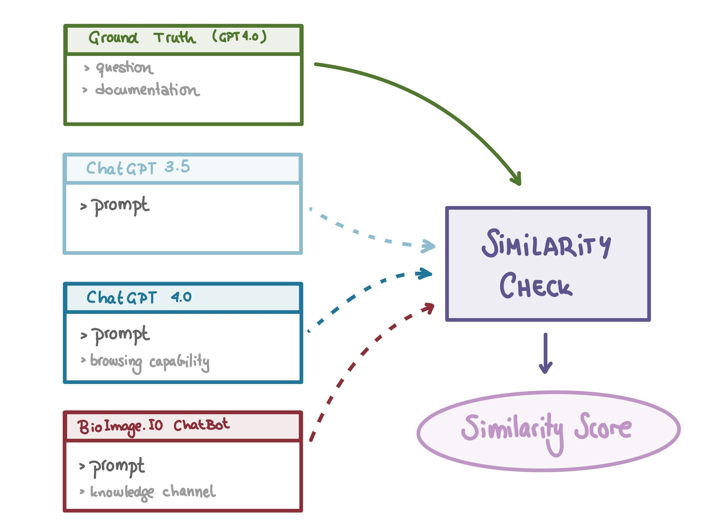

# Decoding Conversational Assistants: BioImage.IO Chatbot and ChatGPT

## Introduction 
This documentation is intended to show, appreciate and differenciate the BioImage.IO Chatbot from ChatGPT. Differences and similarities between these two conversation assistants is a question that has been raised by the community. It is important to remark that these two conversational assistants do not have the same purpose. While ChatGPT is designed to "assist and provide information" to the user depending on the user's input as general as it might be, the BioImage.IO Chatbot is designed to be an assistant for tasks in the specific domain of bioimage analysis, specially regarding the BioImage Model Zoo and other softwares included in the knowledge channels. 

## Feature Comparison
In the following sections, a set of features are going to be studied and compared among the two chatbots to show the differences and similarities between them regarding each of these aspects.

### Context-Awareness
ChatGPT 3.5 (free version) is not fully context aware, each query or input is processed individually even if it's in the same conversation. Hence, it lacks a continious understanding of the broader conversation or the ability to remember past interactions. In contrast, the BioImage.IO Chatbot is context-aware and not only remembers past interactions but the information from these interactions is used to provide a better response to the user.

### Personalization
While ChatGPT 3.5 does not have the ability to personalize the responses to the user, the BioImage.IO Chatbot is designed to tailor the user's prompt with the optional information regarding the user's background and needs. This way, the BioImage.IO Chatbot is able to provide different feedback to the user based on the user's profile.

### Code generation

### User Experience

## Knowledge Retrieval Evaluation
An evaluation method was devised to assess the knowledge retrieval capabilities of the BioImage.IO Chatbot in comparison to ChatGPT 3.5 and 4.0. This method, detailed in the repository [insert link here](), involves the generation of a Ground Truth using GPT-3.5-turbo, where the question is answered with the documentation as context. Subsequently, the same question is posed to ChatGPT 3.5, ChatGPT 4, and the BioImage.IO Chatbot. A Similarity Check is performed for each answer from these chatbots against the Ground Truth, yielding a Similarity Score for each. The entire process is illustrated in the following figure:

To illustrate this evaluation, some specifics cases are going to be detailed in the following queries.

### Who are the main contributors to ilastik?
#### Answers

* **ChatGPT 3.5, *Similarity score: 2.5:*** The main contributors to ilastik are a group of researchers and developers from the ilastik team at the Biomedical Imaging Group at the Center for Systems Biology at the Max Planck Institute of Molecular Cell Biology and Genetics in Dresden, Germany. The team includes experts in computer vision, machine learning, and image processing, who work together to develop and maintain the ilastik software. 
* **ChatGPT 4.0, *Similarity score: 4.5:*** The main contributors to Ilastik, a popular software for interactive image analysis, are primarily from the scientific research community. Key contributors include:Anna Kreshuk - She has been instrumental in the development of Ilastik and is known for her work in machine learning and image analysis.Fred A. Hamprecht - A professor at Heidelberg University, Hamprecht's lab has played a significant role in the development of Ilastik, focusing on computer vision and machine learning.Carsten Haubold - Involved in the development, focusing on the integration of machine learning methods.Teams from European Molecular Biology Laboratory (EMBL) and Heidelberg University: Collaborative efforts between these institutions have been central to Ilastik's development.These contributors, along with many others in the scientific community, have made significant developments to the software, contributing to its capabilities in image segmentation, classification, and analysis.
* **BioImage.IO Chatbot, *Similarity score: 1:*** The main contributors to ilastik are not explicitly listed in the provided documentation excerpts. However, ilastik is presented as an open-source tool under the BSD license, which invites collaboration and contributions from developers in the field of biomedical image processing. For more detailed information about the contributors, you may want to check the [ilastik homepage](https://www.ilastik.org/documentation/) or contact the community via the [mailing list](mailto:ilastik-user@ilastik.org).

#### Evaluation
In this questions is shown how the three conversational assistants behaviour when asking a complex question. In this case, ChatGPT 3.5 Got not only didn't know how to answer the question that it invented it the answer. ChatGPT 4.0 was able to answer the question but it was not able to provide a link to the documentation. The BioImage.IO Chatbot was not able to answre the question but it was aware of it. Hence, despite on not having the exact answr, it was able to provide a link to the documentation.

## Conclusions