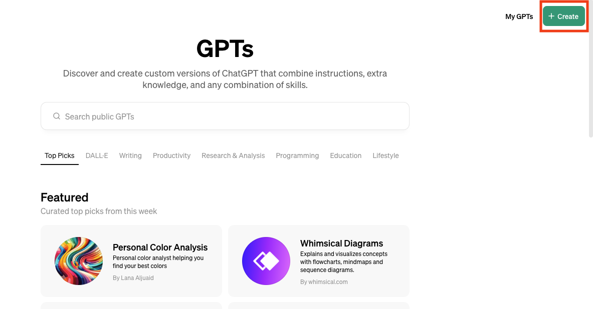
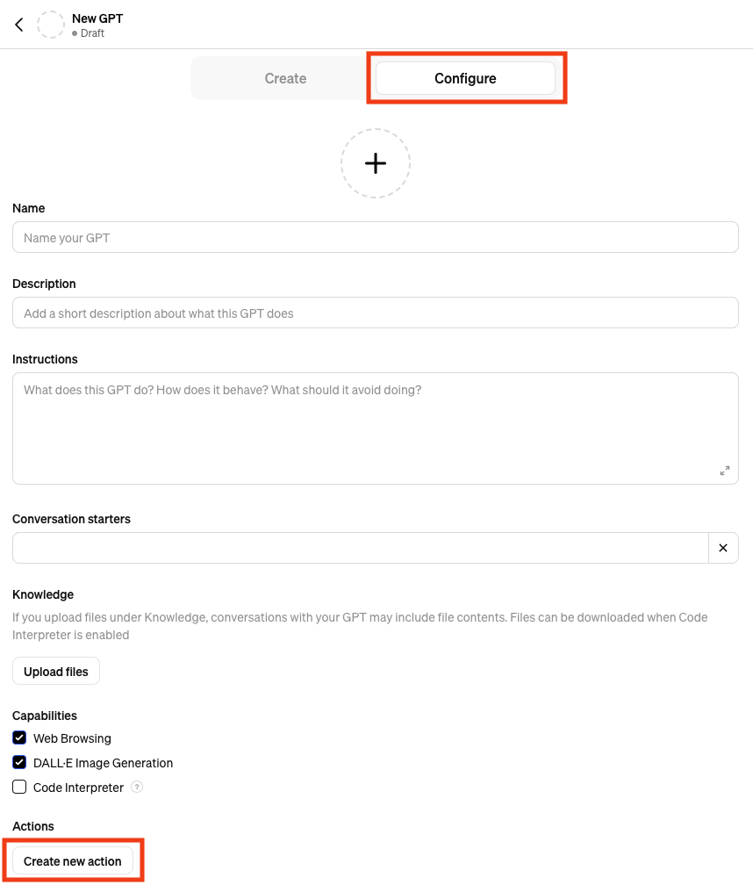
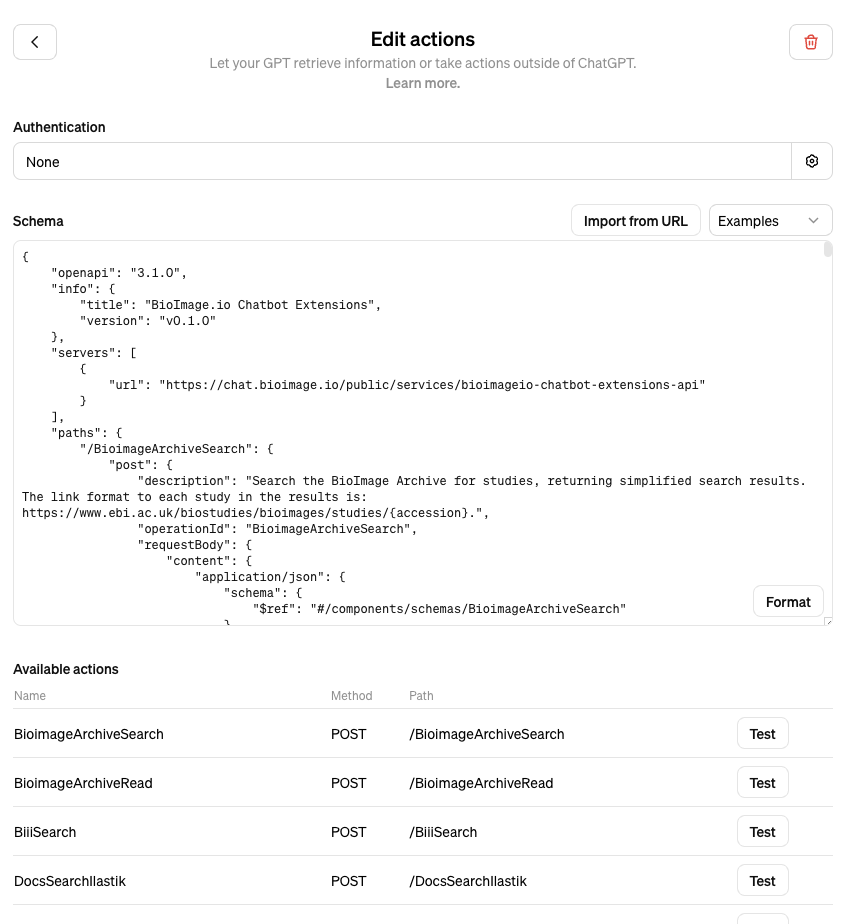

# Creating OpenAI GPTs with Chatbot Extensions

## Introduction
In addition to standalone usage, the BioImage.IO Chatbot supports porting extensions to OpenAI custom [GPTs](https://chat.openai.com/gpts) for users with OpenAI accounts. Chatbot extensions following the development model specified in the [development guidelines](./development.md) and [notebook tutorial](./bioimage-chatbot-extension-tutorial.ipynb) are automatically converted to `openapi` schema which can be used to create OpenAI GPTs using the online GPT creator. 

`openapi` schemas for extensions are generated on Chatbot server startup via the `register_service` function in  [gpts_action.py](../bioimageio_chatbot/gpts_action.py). These schemas are then made available for OpenAI GPT creator import directly via url. This process for creating a custom GPT from the public BioImage.IO Chatbot instance extensions is shown below. Users are encouraged to submit their extensions to the BioImage.IO team for incorporation into the public Chatbot instance. 

Note that GPT actions are run through the hosted server instance (chat.bioimage.io in the case of the public Chatbot instance). Also note that the creation of custom OpenAI GPTs requires a paid OpenAI account. 

## Creating a Custom GPT from the public Chatbot Instance
The public Chatbot instance's `openapi` extension schema are available at the following link: `https://chat.bioimage.io/public/services/bioimageio-chatbot-extensions-api/get_openapi_schema`

After logging in to their OpenAI accounts, users can navigate to the GPTs [page](https://chat.openai.com/gpts) and click `Create` as shown below:

To add GPT actions from Chatbot extensions, navigate to the `Configure` tab and select `Create new action`:

The Chatbot-generated `openapi` schema can then be imported direct by selecting `Import from URL` and inputting the public Chatbot's extension schema `https://chat.bioimage.io/public/services/bioimageio-chatbot-extensions-api/get_openapi_schema`

Users can edit the JSON content to select individual actions from the Chatbot extensions if desired:

