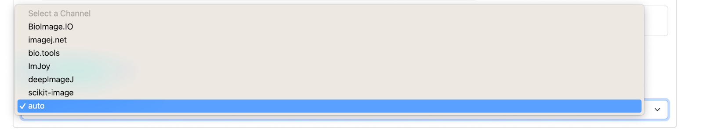
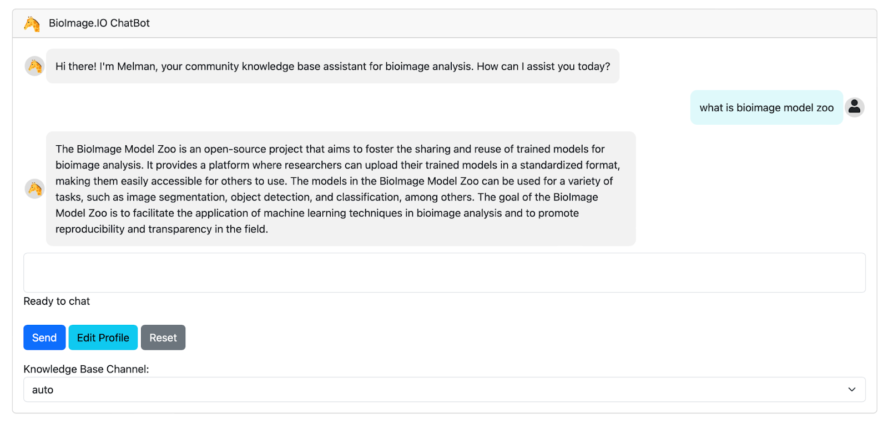
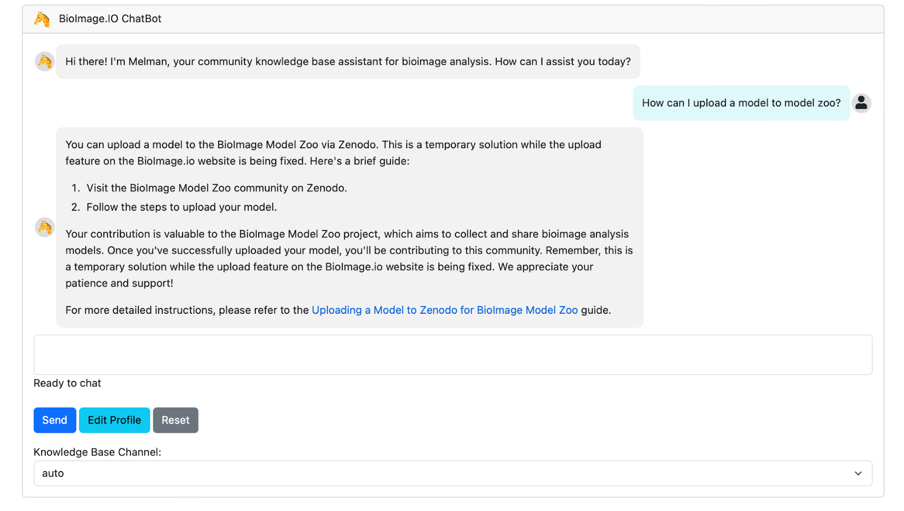
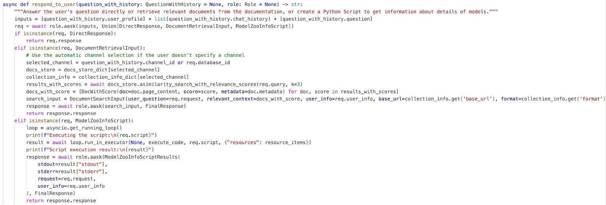
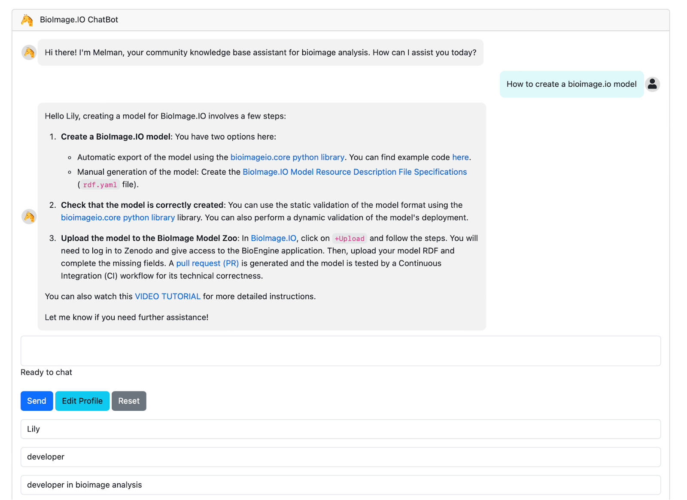

# Examples

## ChatBot interface

Following installation guidelines from [README.mk](README.md), the chat interface looks like Supplementary Figure 1. User can input their profile as shown in Supplementary Figure 2. 
As for today, our knowledge bases for the chatbot are drawn from documentation spanning below pivotal communities: bioimage.io, Imjoy, deepimageJ, ImageJ, bio.tools and scikit-image. A key feature of the implementation is the user's ability to specify a channel from which they prefer to retrieve information (Supplementary Figure 3). If the user designates a channel, the chatbot seamlessly sources information from that specific community. However, in cases where the channel is not specified, the chatbot utilizes an intelligent selection process guided by the schema-based agent to determine the most relevant channel based on the user's question. We will elaborate on the schema-based agent in the following, which plays a central role in this seamless and efficient retrieval process.

This approach, combining the collaborative knowledge base from multiple communities with user-directed channel selection, empowers users from various domains to contribute to the chatbot's knowledge base, making it a versatile and invaluable resource for a continually expanding community of users.

## Schema-Based Agent Design

Our chatbot's efficacy in understanding and responding to user queries is significantly enhanced through the innovative approach of schema-based agent design. Instead of relying solely on pure-context prompts, which often fall short when extracting specific information from user queries or understanding complex requirements, we employ predefined schemas to a schema-based agent to guide the conversation and information retrieval process. Schemas are data structures that represent various kinds of knowledge. In agent design, schemas often determine how an agent perceives its environment, makes decisions, and acts upon those decisions. They can represent anything from simple tasks to complex actions or sequences.

The schema-based agent is built upon the function-call LLM, and it utilizes input and output schema to generate text output. Specifically, by passing a union of pydantic forms (schemas) for the output, the schema agent will decide which schema to use for generating the output based on the given input context. Within the implementation, we create the customer service chatbot by inputting the fields of a role class (Supplementary Figure7). When responding to the user, we have designed three distinct response modes to optimize the chatbot's service: Direct Response, Response from Documentation Retrieval, and Script Generation and Execution, as detailed in the following context.

To determine which response mode is best suited for a given query, we integrate the user's original question with the conversation history and the user's profile into a single input. This combined input, along with the three schemas, is passed to the schema agent, enabling it to decide the appropriate response mode for answering the question (Supplementary Figure 8). This step is not only helpful for selecting the suitable response schema for the schema agent to provide more efficient and accurate answers, but it is also necessary to reorganize the original question into a clear and concise form for better understanding and more efficient retrieval in the following.  

Now, let's explore how these response modes operate to offer tailored and effective interactions with users. The Three Response Modes are:

Direct Response: In the case of straightforward questions, where the user seeks basic information about the BioImage Model Zoo or related topics, our chatbot provides direct responses. For instance, if a user inquires, "What is BioImage Model Zoo?" The chatbot can readily generate a concise and accurate answer, drawing from its pre-configured profile (Supplementary Figure 4).

Response from Documentation Retrieval: When users ask more complex or specific questions about bioimage analysis information like bioimage.io, model zoo, or Imjoy, the chatbot responds using information retrieved from the corresponding database. The chatbot first extracts key queries from the user's question, and then utilizes these key queries to retrieve relevant information from the BioImage Model Zoo documentation repository. By incorporating schema-based agent, the chatbot can better understand and analyze user queries, significantly improving the accuracy of document retrieval. For example, if a user asks, "How can I upload a model to the BioImage Model Zoo?" The chatbot can effectively identify the key query as "model upload," retrieve pertinent documents and generate a comprehensive response (Supplementary Figure 5).

Script Generation and Execution: Some user queries may require a more intricate response. In cases where users seek specific model details or actions, the chatbot can dynamically create scripts (like python) tailored to the user's needs. It then executes these scripts using the available model resource files. For example, if a user inquires, "What models in the Model Zoo can perform segmentation tasks?," the chatbot can automatically generate and execute a script to identify and list models suitable for image segmentation (Supplementary Figure 6).

This schema-based agent design not only enables the chatbot to differentiate and adapt to diverse user queries but also significantly enhances the overall user experience. It ensures that users receive responses that are not only relevant but also presented in a structured and understandable manner.

## Customization of the Chatbot

Customization is a crucial element in our chatbot's design, especially in the dynamic field of bioimage analysis, which attracts users from diverse backgrounds such as developers, researchers, and biologists. We've harnessed the flexibility of the schema-agent to enable users to provide information about their background. For instance, if a user has a background in bioimage analysis, this information is seamlessly integrated into their interactions with the chatbot (see Supplementary Figure 9). On the other hand, if a user lacks a bioimage analysis background but submits the same query, the chatbot utilizes the user's profile information to respond in a way that ensures better understanding and a more tailored experience (Supplementary Figure 10). The customization also offers users the option to specify a channel from which they prefer to retrieve information. If the user designates a channel, the chatbot seamlessly sources information from that specific community (Supplementary Figure 11). 

 # Examples 

Supplementary Figure 1. The chat interface of BioImage.IO ChatBot.

Supplementary Figure 2. Users can input their profile by clicking `Edit Profile` to personalized responses and `Save` to save their profile for future conversations. 
.

Supplementary Figure 3. Users can select a specific channel from ‘Knowledge Base Channel’ to personalize the conversation.

Supplementary Figure 4. Direct response for simple and easy questions.

Supplementary Figure 5. Response by retrieving text information from the knowledge base. 

Supplementary Figure 6. Response by generating code script and executing the script using the available model resource item to retrieve information for responding. 

Supplementary Figure 7. Creating a chatbot role class named ‘CustomerServiceRole’ by inputting the fields of a role class. 

Supplementary Figure 8. Integrate the user's original question with the conversation history and the user's profile into a single input `inputs`. The inputs along with the three schemas is passed to the schema agent via calling `role.aask()` enabling the agent to reformulate the questions and decide the appropriate response mode for answering the question. 

Supplementary Figure 9. Customerization for user with bioimage analysis background. 

Supplementary Figure 10. Customerization for user without any bioimage analysis background. 

Supplementary Figure 11. Customerization when selecting specific channel ‘bio.tools’.

## Reference
1. FAISS (Facebook AI Similarity Search), https://github.com/bioimage-io/bioimageio-chatbot 
2. Bioimage.io, https://bioimage.io/docs/#/
3. Imjoy, Ouyang, Ouyang, Wei, Florian Mueller, Martin Hjelmare, Emma Lundberg, and Christophe Zimmer. "ImJoy: an open-source computational platform for the deep learning era." Nature methods 16, no. 12 (2019): 1199-1200.. https://imjoy.io/docs/#/ 
4. deepimageJ, Gómez-de-Mariscal, Estibaliz, Carlos García-López-de-Haro, Wei Ouyang, Laurene Donati, Emma Lundberg, Michael Unser, Arrate Munoz-Barrutia, and Daniel Sage. "DeepImageJ: A user-friendly environment to run deep learning models in ImageJ." Nature Methods 18, no. 10 (2021): 1192-1195. https://deepimagej.github.io/ 
5. ImageJ, https://imagej.net 
6. bio.tools, https://bio.tools 
7. scikit-image, https://scikit-image.org/docs/stable/ 
8. Function calling API, https://openai.com/blog/function-calling-and-other-api-updates

