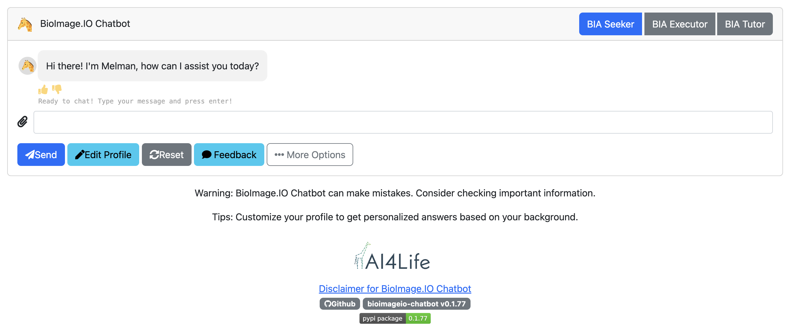
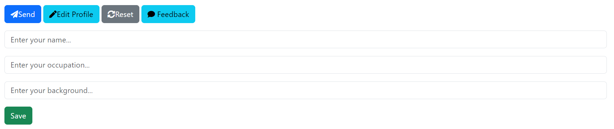
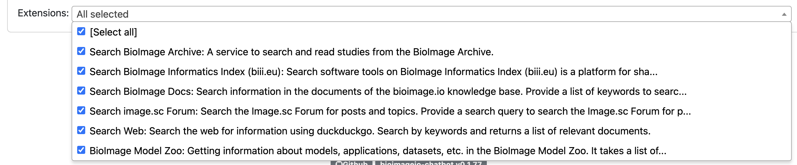
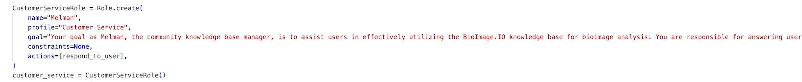
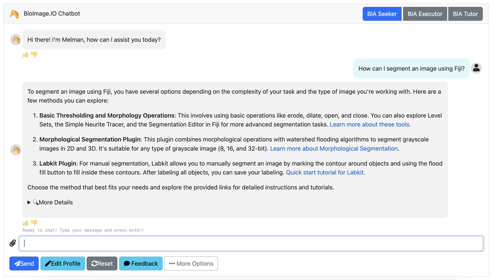
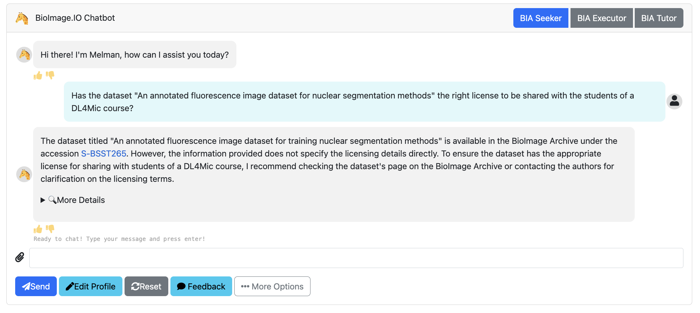
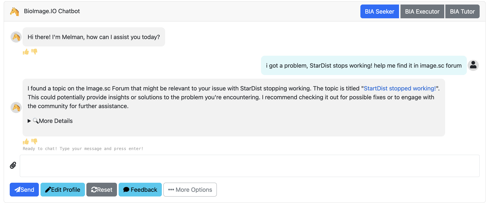
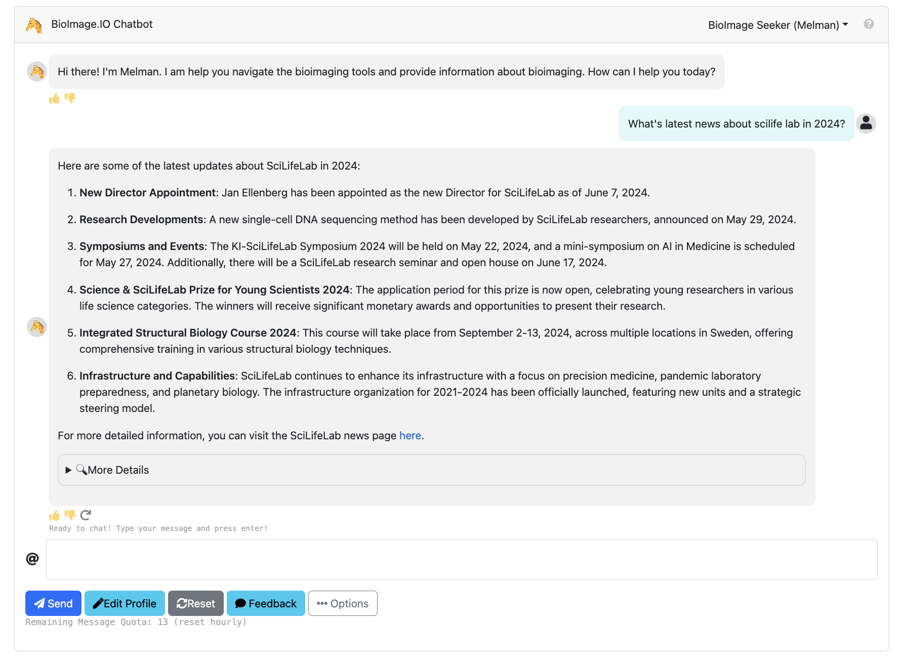

# Design and Functionality of BioImage.IO Chatbot: A User Guide and Technical Overview

## Chatbot Interface

After following the installation guidelines from the [README](/README.md), the chat interface will resemble Figure 1.

*Figure 1. The chat interface of the BioImage.IO Chatbot.*

Users can input their profiles as depicted in Figure 2. 

*Figure 2. Users can personalize responses by clicking `Edit Profile` and save their settings for future conversations by clicking `Save`.*

As of today, our chatbot integrates 6 extensions including document search in bioimage.io knowledge base, tools search on Bioimage Informatics Index (biii.eu), bioimage topics search in Bioimage Archive and Image.cs Forum, web search, and information search in Bioimage Model Zoo. The document search utilizes knowledge bases from the following pivotal communities: bioimage.io [2], Imjoy [3], deepimageJ [4], ImageJ [5], bio.tools [6], and scikit-image [7]. We also allow users to specify a preferred extension for information retrieval, as shown in Figure 3. If an extension is designated, the chatbot sources information using the specific extension and its corresponding source. Otherwise, it uses an intelligent selection process driven by a schema-based agent to choose the most relevant extension based on the user's query. 

*Figure 3. Users can personalize the conversation by selecting a specific channel from the ‘Knowledge Base Channel’.*

### Building the Knowledge Base

The knowledge base is efficiently and collaboratively constructed by downloading documentation from given URLs. These can be repositories, PDFs, or other forms of documentation. We use a regular expression splitter to segment the documentation into manageable chunks for efficient and accurate retrieval. These chunks are then embedded and stored as vectors in a FAISS [1]-based vector database.

## Schema-Based Agent Design

The chatbot's ability to understand and respond to user queries is substantially improved by employing a schema-based agent design. Unlike traditional context-based models, our approach utilizes predefined schemas to guide the conversation and information retrieval process. 

The schema-based agent operates on the function-call LLM [8], and uses input and output schemas to generate text output. Within this implementation, we construct a customer service chatbot by defining a role class, as shown in Figure 4.

*Figure 4. Creation of a chatbot role class named ‘CustomerServiceRole’ by defining fields of the role class.*

## Extensions
The BioImage.IO Chatbot employs diverse methods to generate responses, currently encompassing five distinct response modes. The response mode is chosen by the schema-based agent based on the user's query and the selected channel.

### Search BioImage Docs
This extension allows the chatbot to search information in a community-driven bioimage related knowledge base. With a specific query, the chatbot extracts essential elements from the user's question to fetch information from the relevant documentation. 
        
    *Figure 6. Search in Bioimage Knolwedge base documentation.*

### Search BioImage Information Index (biii.eu)
This extension allows the chatbot to search online software tool in biii.eu.
    
    *Figure 7. Search in biii.eu.*

The process begins with an initial response based on the user's query (`request`), which serves as a foundation for generating a new `query` for targeted information retrieval. This is combined with user profile data (`user_info`) and the query to produce a comprehensive final response.

### Search Bioimage Archive
This extension allows the chatbot to search for dataset index in bioimage archive. 
    
    *Figure 8. Search in bioimage archive.*

### Search image.sc Forum
This extension allows the chatbot to search bioimage related topics and software issues in the image.sc forum.
    
    *Figure 9. Search in image.sc forum.*

### Search Web
This extension allows the chatbot to search for information from the web. This extension is triggered while the chatbot realizes it can not find relevant information from the knowledge base.
    
    *Figure 10. Search in the web.*

### BioImage Model Zoo
This mode is designed for queries requiring detailed model information or specific actions, generating and executing Python scripts for tailored solutions.
    
    *Figure 11. Scripting retrieval for complex queries.*

It involves creating a `ModelZooInfoScript` schema with fields like `request`, `user info`, and `script`, where `script` is Python code for API interactions or data manipulation. The final response is formulated by integrating the script's output with the `request` and `user info`.

## References

1. [FAISS](https://engineering.fb.com/2017/03/29/data-infrastructure/faiss-a-library-for-efficient-similarity-search/)
2. [Bioimage.io](https://bioimage.io/docs/#/)
3. [Imjoy](https://imjoy.io/docs/#/)
4. [DeepImageJ](https://deepimagej.github.io/)
5. [ImageJ](https://imagej.net)
6. [bio.tools](https://bio.tools)
7. [scikit-image](https://scikit-image.org/docs/stable/)
8. [Function-Calling API](https://openai.com/blog/function-calling-and-other-api-updates)
9. [CellPose](https://www.cellpose.org)
